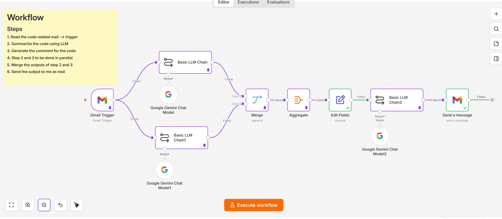
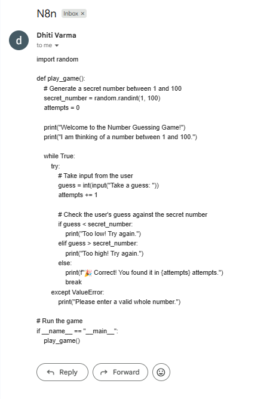

# AI Automated Code Summarization System

An AI-powered workflow automation system built using n8n that automatically analyzes code received through email. The workflow processes incoming code using Large Language Models (LLMs), generates summaries and developer-friendly comments, aggregates the outputs, and sends the final processed response back through email.

## Screenshots



## Features

- Gmail-triggered workflow automation
- AI-powered code summarization
- Automated code commenting
- Parallel LLM processing
- Aggregated AI responses
- Automated email delivery
- Gemini LLM integration
- Workflow orchestration using n8n

## Tech Stack

- n8n
- Google Gemini API
- Gmail Integration
- AI Prompt Engineering
- Workflow Automation
- LLM Chains

## Workflow Overview

1. Gmail receives a code-related email
2. Workflow triggers automatically
3. Two parallel LLM chains process the code:
   - Code Summarization
   - Code Comment Generation
4. Outputs are merged and aggregated
5. Final formatting and cleanup is performed
6. Processed response is emailed back automatically

## Workflow Architecture

```text
Gmail Trigger
      ↓
Parallel AI Processing
 ┌───────────────┐
 ↓               ↓
Code Summary   Code Comments
 └───────────────┘
      ↓
Merge Results
      ↓
Aggregate + Format
      ↓
Final LLM Processing
      ↓
Send Email Response
```

### Workflow


### Input Email



### Output Email


## Project Structure

```text
ai-automated-code-summarization-system/
│
├── README.md
├── LICENSE
├── .gitattributes
├── workflow.json
│
├── screenshots/
│   ├── workflow.png
│   ├── input-email.png
│   └── output-email.png
│
├── docs/
│   ├── architecture.md
│   ├── workflow-explanation.md
│   └── setup-guide.md
│
└── prompts/
    ├── summary-prompt.txt
    ├── comments-prompt.txt
    └── final-formatting-prompt.txt
```

## AI Processing Pipeline

The workflow uses multiple LLM chains to:

- Analyze incoming code
- Generate concise summaries
- Create developer-friendly comments
- Aggregate outputs into a structured response
- Format final email responses

## Documentation

Additional workflow documentation is available inside the `docs/` folder.

- `architecture.md`
- `workflow-explanation.md`
- `setup-guide.md`

## License

This project is licensed under the MIT License.

---

## Author

Built by Dhiti Varma
